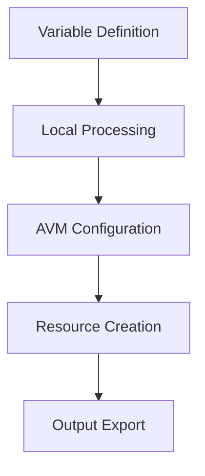

# Active Context

## Current Focus

The project is developing two parallel connectivity approaches:

1. **Traditional Hub-Spoke (connectivity module)**

   - VNet Gateway Configuration
     - Implementing flexible gateway options
     - Supporting both VPN and ExpressRoute
     - Enabling active-active configurations
   - Hub-spoke networking pattern
   - DNS resolution services
   - Network security controls

2. **Virtual WAN (connectivity-vwan module)**
   - VWAN Hub implementation
   - ExpressRoute circuit integration
   - Resource group management
   - Regional deployment patterns

## Recent Implementations

### Module Implementations

1. **Hub-Spoke Connectivity**

   ```hcl
   module "avm-ptn-vnetgateway" {
     source  = "Azure/avm-ptn-vnetgateway/azurerm"
     version = "0.6.3"
     # Configured with flexible options for VPN setup
   }
   ```

2. **VWAN Connectivity**

   ```hcl
   resource "azurerm_virtual_wan" {
     name                = local.vwan_name
     resource_group_name = local.resource_group_name
     location            = local.location
     # Configured for global connectivity
   }
   ```

3. **Shared Components**
   - Route tables with custom routes
   - Network security groups
   - DNS resolver endpoints

### Testing Framework

- Implemented Terratest structure
- Defined test scenarios for connectivity
- Added subnet configuration validation

## Active Decisions

### 1. Network Architecture Choices

- Supporting both Hub-Spoke and VWAN patterns
- Using Azure Verified Modules as foundation where available
- Separating variable definitions by resource
- Implementing clear module dependencies
- Regional deployment strategies

### 2. Implementation Standards

- Consistent resource naming
- Standardized tagging approach
- Module-level test coverage

### 3. Configuration Patterns



## Current Patterns

### 1. Resource Organization

- Separate files per resource type
- Clear variable scoping
- Local variable consolidation
- Regional code mapping

### 2. Module Structure

```
.
├── connectivity/              # Traditional hub-spoke
│   ├── main.*.tf
│   ├── variables.*.tf
│   ├── locals.tf
│   └── test/
└── connectivity-vwan/        # VWAN implementation
    └── core/
        ├── main.*.tf
        ├── variables.*.tf
        ├── locals.tf
        └── test/
```

### 3. Testing Approach

- Unit tests per resource
- Integration testing for dependencies
- Automated cleanup

## Key Learnings

1. **Module Design**

   - Keep resource configurations focused
   - Use clear variable naming
   - Document dependencies explicitly

2. **Testing Strategy**

   - Implement tests early
   - Cover key configurations
   - Validate resource relationships

3. **Documentation**
   - Maintain clear module documentation
   - Document design decisions
   - Keep usage examples updated

## Next Steps

1. **Short Term**

   - Complete VWAN hub implementation
   - Integrate ExpressRoute circuits
   - Add DNS resolver configuration
   - Expand test coverage for both connectivity patterns

2. **Medium Term**

   - Implement management module
   - Add identity components
   - Enhance documentation
   - Cross-connectivity patterns between VWAN and hub-spoke

3. **Long Term**
   - Complete all core modules
   - Add advanced features
   - Create deployment examples
   - Global connectivity patterns
