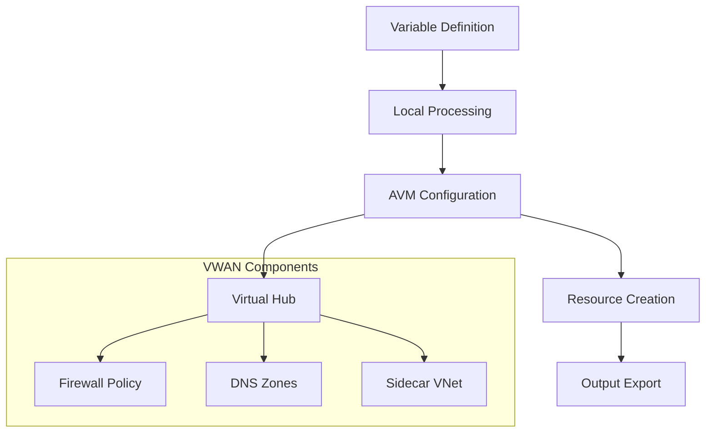

# Active Context

## Current Focus

The project is developing two parallel connectivity approaches:

1. **Traditional Hub-Spoke (connectivity module)**

   - VNet Gateway Configuration
     - Implementing flexible gateway options
     - Supporting both VPN and ExpressRoute
     - Enabling active-active configurations
   - Hub-spoke networking pattern
   - DNS resolution services
   - Network security controls

2. **Virtual WAN (connectivity-vwan module)**
   - Migrated to Azure Verified Module pattern using avm-ptn-alz-connectivity-virtual-wan
   - Enhanced VWAN Hub implementation with firewall policy
   - Private DNS zones integration with resolver
   - Sidecar virtual network support
   - ExpressRoute circuit integration
   - Resource group management
   - Regional deployment patterns

## Recent Implementations

### Module Implementations

1. **Hub-Spoke Connectivity**

   ```hcl
   module "avm-ptn-vnetgateway" {
     source  = "Azure/avm-ptn-vnetgateway/azurerm"
     version = "0.6.3"
     # Configured with flexible options for VPN setup
   }
   ```

2. **VWAN Connectivity**

   ```hcl
   module "connectivity-virtual-wan" {
     source  = "Azure/avm-ptn-alz-connectivity-virtual-wan/azurerm"
     version = "0.2.0"

     virtual_hubs = {
       vhub = {
         hub = {
           name           = local.virtual_hub_name
           address_prefix = "10.0.0.0/23"
         }
         firewall = {
           name     = local.firewall_name
           sku_tier = "Premium"
         }
         firewall_policy = {
           name = local.firewall_policy_name
           sku  = "Standard"
         }
         private_dns_zones = {
           subnet_address_prefix = "10.0.1.0/24"
         }
         side_car_virtual_network = {
           name          = local.shared_vnet_name
           address_space = ["10.0.2.0/24"]
         }
       }
     }
   }
   ```

3. **Shared Components**
   - Route tables with custom routes
   - Network security groups
   - DNS resolver endpoints
   - Private DNS zones with link support
   - Firewall policies with threat intelligence

### Testing Framework

- Enhanced Terratest structure with SKIP_DESTROY support
- Comprehensive test scenarios for VWAN components
- Added subnet configuration validation
- Firewall policy testing
- Private DNS zones integration testing
- Sidecar VNet subnet validation

## Active Decisions

### 1. Network Architecture Choices

- Supporting both Hub-Spoke and VWAN patterns
- Using Azure Verified Modules as foundation where available
- Separating variable definitions by resource
- Implementing clear module dependencies
- Regional deployment strategies
- Enhanced security with firewall policies
- DNS resolution with private zones

### 2. Implementation Standards

- Consistent resource naming
- Standardized tagging approach
- Module-level test coverage
- Optional resource cleanup in tests

### 3. Configuration Patterns



## Current Patterns

### 1. Resource Organization

- Separate files per resource type
- Clear variable scoping
- Local variable consolidation
- Regional code mapping
- Enhanced security patterns

### 2. Module Structure

```
.
├── connectivity/              # Traditional hub-spoke
│   ├── main.*.tf
│   ├── variables.*.tf
│   ├── locals.tf
│   └── test/
└── connectivity-vwan/        # VWAN implementation
    └── core/
        ├── main.*.tf
        ├── variables.*.tf
        ├── locals.tf
        └── test/
            └── connectivity_vwan_test.go  # Enhanced test coverage
```

### 3. Testing Approach

- Unit tests per resource
- Integration testing for dependencies
- Optional resource cleanup
- Enhanced validation for new components
- Controlled test environment

## Key Learnings

1. **Module Design**

   - Keep resource configurations focused
   - Use clear variable naming
   - Document dependencies explicitly
   - Leverage AVM patterns effectively

2. **Testing Strategy**

   - Implement tests early
   - Cover key configurations
   - Validate resource relationships
   - Support testing flexibility

3. **Documentation**
   - Maintain clear module documentation
   - Document design decisions
   - Keep usage examples updated
   - Track implementation progress

## Next Steps

1. **Short Term**

   - Additional VWAN hub components
   - Further ExpressRoute integration
   - Enhanced DNS resolver configuration
   - Expand test coverage for both connectivity patterns

2. **Medium Term**

   - Implement management module
   - Add identity components
   - Enhance documentation
   - Cross-connectivity patterns between VWAN and hub-spoke

3. **Long Term**
   - Complete all core modules
   - Add advanced features
   - Create deployment examples
   - Global connectivity patterns
