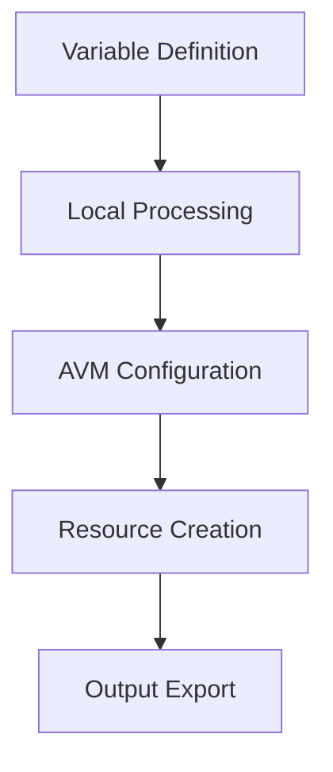

# Active Context

## Current Focus

The project is currently focused on the connectivity module implementation, with emphasis on:

1. **VNet Gateway Configuration**

   - Implementing flexible gateway options
   - Supporting both VPN and ExpressRoute
   - Enabling active-active configurations

2. **Network Architecture**
   - Hub-spoke networking pattern
   - DNS resolution services
   - Network security controls

## Recent Implementations

### Connectivity Module

1. **VNet Gateway**

   ```hcl
   module "avm-ptn-vnetgateway" {
     source  = "Azure/avm-ptn-vnetgateway/azurerm"
     version = "0.6.3"
     # Configured with flexible options for VPN setup
   }
   ```

2. **Networking Components**
   - Route tables with custom routes
   - Network security groups
   - DNS resolver endpoints

### Testing Framework

- Implemented Terratest structure
- Defined test scenarios for connectivity
- Added subnet configuration validation

## Active Decisions

### 1. Architecture Choices

- Using Azure Verified Modules as foundation
- Separating variable definitions by resource
- Implementing clear module dependencies

### 2. Implementation Standards

- Consistent resource naming
- Standardized tagging approach
- Module-level test coverage

### 3. Configuration Patterns



## Current Patterns

### 1. Resource Organization

- Separate files per resource type
- Clear variable scoping
- Local variable consolidation

### 2. Module Structure

```
connectivity/
├── main.*.tf         # Resource configurations
├── variables.*.tf    # Input definitions
├── locals.tf         # Computed values
└── test/            # Test implementations
```

### 3. Testing Approach

- Unit tests per resource
- Integration testing for dependencies
- Automated cleanup

## Key Learnings

1. **Module Design**

   - Keep resource configurations focused
   - Use clear variable naming
   - Document dependencies explicitly

2. **Testing Strategy**

   - Implement tests early
   - Cover key configurations
   - Validate resource relationships

3. **Documentation**
   - Maintain clear module documentation
   - Document design decisions
   - Keep usage examples updated

## Next Steps

1. **Short Term**

   - Complete VNet Gateway implementation
   - Add DNS resolver configuration
   - Expand test coverage

2. **Medium Term**

   - Implement management module
   - Add identity components
   - Enhance documentation

3. **Long Term**
   - Complete all core modules
   - Add advanced features
   - Create deployment examples
