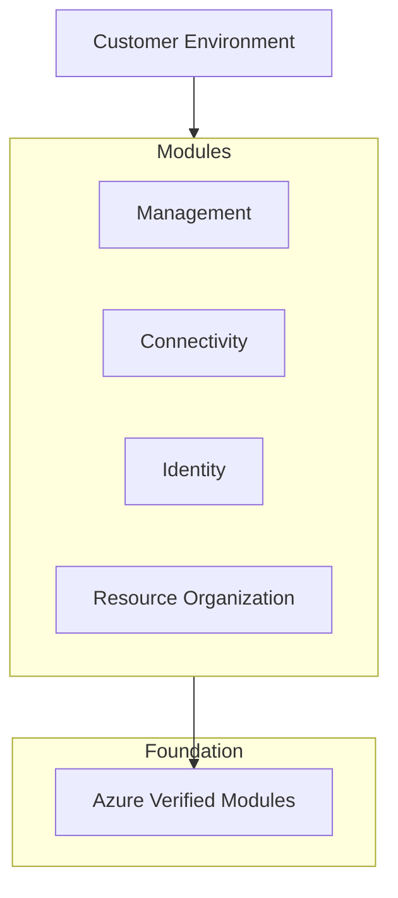
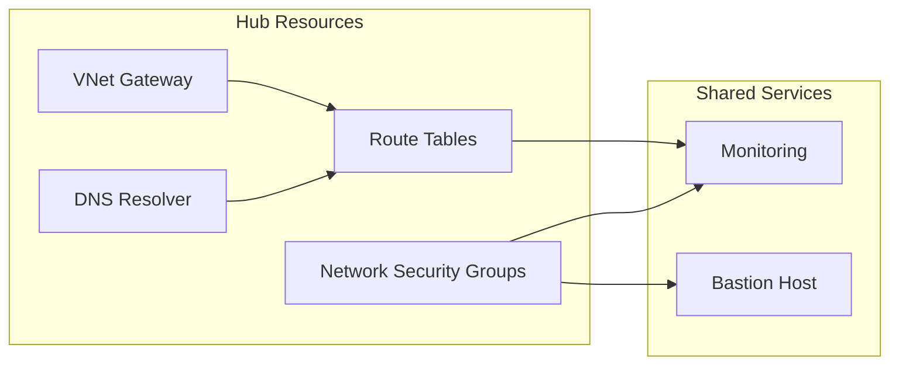
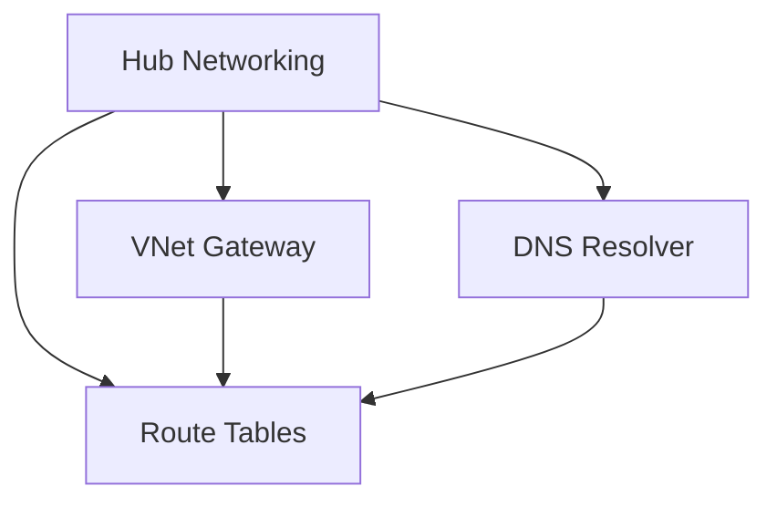

# System Patterns

## Core Architecture

## Design Patterns

### 1. Module Architecture

- **AVM-First Design**: Built on Azure Verified Modules for core resource provisioning
- **Layer Separation**: Clear separation between AVM foundation and custom logic
- **Interface Contracts**: Well-defined input/output specifications per module
- **Version Control**: Explicit module versioning and dependency management

### 2. Network Design

Based on the connectivity module implementation:

- **Hub-Spoke Architecture**

  - Centralized hub VNet
  - DNS resolution services
  - Shared services placement
  - Cross-network connectivity

- **Security Patterns**
  - Network security groups with standardized rules
  - Route tables for traffic control
  - Private DNS zones for internal resolution

### 3. Resource Management

## Implementation Paths

### 1. Connectivity Module

Current implementation shows:

- VNet Gateway with configurable options
- Custom route table creation
- Integration with hub networking
- Support for both public and private IP configurations

### 2. Testing Strategy

Based on connectivity_test.go:

- Terratest for infrastructure validation
- Parallel test execution
- Subnet configuration validation
- Resource dependency testing

## Component Relationships

### Module Dependencies

### Resource Flow

1. **Base Infrastructure**

   - Resource groups
   - Core networking
   - Security components

2. **Connectivity Layer**

   - VNet Gateway deployment
   - DNS resolver configuration
   - Route table association

3. **Service Integration**
   - Private endpoints
   - Monitoring integration
   - Security services

## Design Decisions

1. **Modular Composition**

   - Independent module deployment
   - Minimal cross-module dependencies
   - Clear interface boundaries

2. **Configuration Management**

   - Variable-driven customization
   - Default value patterns
   - Override capabilities

3. **Security Integration**
   - Network segmentation
   - Access control patterns
   - Monitoring integration
